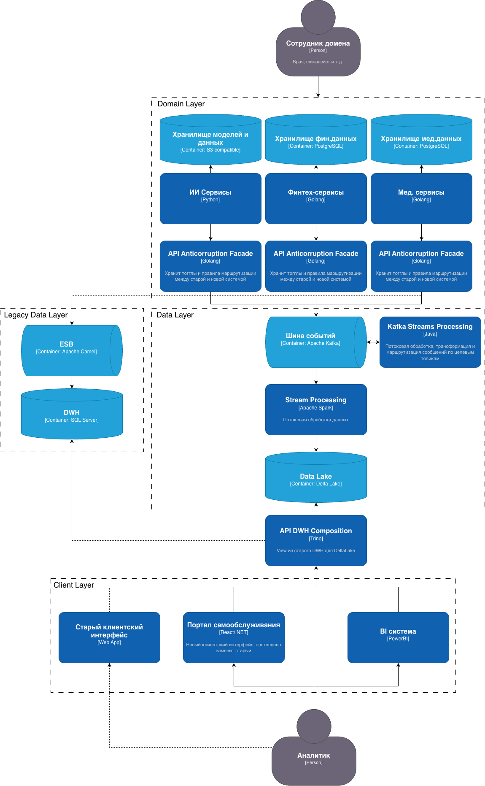
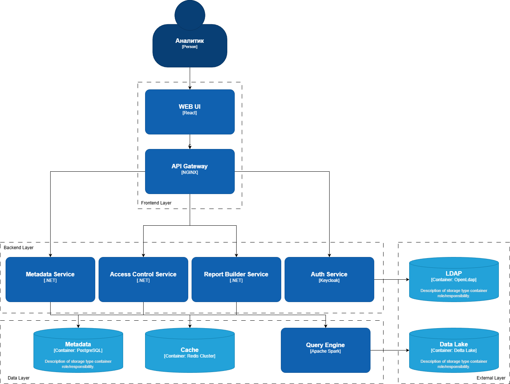

### Диаграмма контейнеров

### Диаграмма компонентов

### Карта рисков трансформации

| Категория | Риск | Вероятность | Влияние |
|-----------|------|-------------|---------|
| **Архитектурные** | Недостаточная производительность событийной платформы под пиковую нагрузку | Средняя | Высокое |
| | Сложность обеспечения консистентности данных в eventually consistent системе | Высокая | Высокое |
| | Плохое качество данных/схем событий | Высокая | Высокое |
| | Потеря бизнес-логики при миграции из DWH | Высокая | Высокое |
| | Сложность реинжиниринга ETL-процессов из DWH | Высокая | Высокое |
| **Технологические** | Нехватка компетенций по Kafka, потоковой обработке, микросервисам | Высокая | Высокое |
| | Сложность миграции сотен ТБ данных из старого DWH | Высокая | Высокое |
| | Несовместимость новых решений с легаси-системами | Средняя | Среднее |
| **Организационные** | Сопротивление сотрудников переходу на новые процессы | Высокая | Среднее |
| | "Расползание" границ доменов, нарушение принципов владения данными | Средняя | Высокое |
| | Недооценка объемов работ, срыв сроков и бюджета | Высокая | Высокое |
| | Недостаточное документирование бизнес-логики в DWH | Высокая | Высокое |

### План управления рисками

| Риск | Меры по снижению | Тип решения |
|------|------------------|-------------|
| **Недостаточная производительность платформы** | Нагрузочное тестирование пилотного домена, поэтапное масштабирование | Техническое |
| **Сложность обеспечения консистентности** | Внедрение Compensating Actions, документация потоков данных, паттерн Saga | Архитектурное/Организационное |
| **Плохое качество данных/схем** | Schema Registry в Kafka, код-ревью контрактов, Data Governance команда | Техническое/Управленческое |
| **Нехватка компетенций** | Пилотный проект в некритичном домене, привлечение экспертов, обучение сотрудников | Управленческое |
| **Сложность миграции данных** | Стратегия "Dual Write", CDC-инструменты (Debezium), тестирование миграции | Техническое/Управленческое |
| **Несовместимость с легаси** | Антикоррупционный слой, четкие границы ответственности, план отказа от легаси | Архитектурное |
| **Сопротивление сотрудников** | Change Management: демонстрации выгод, агенты изменений, инструкции, воркшопы | Управленческое |
| **"Расползание" границ доменов** | Формальное определение границ (DDD), архитектурный комитет, принцип владения данными | Управленческое/Архитектурное |
| **Недооценка объемов работ** | Итеративная разработка, регулярные демо, Proof-of-Concept, MVP подход | Управленческое |
| **Потеря бизнес-логики при миграции** | Реверс-инжиниринг DWH, инвентаризация хранимых процедур, поэтапный перенос | Техническое/Управленческое
| **Сложность реинжиниринга ETL** | Стратегия "Strangler Fig": постепенная замена процессов, параллельная работа старых и новых ETL | Архитектурное
| **Недостаточная документация** | Создание "команды знаний" из опытных разработчиков, скринкасты, воркшопы | Управленческое
